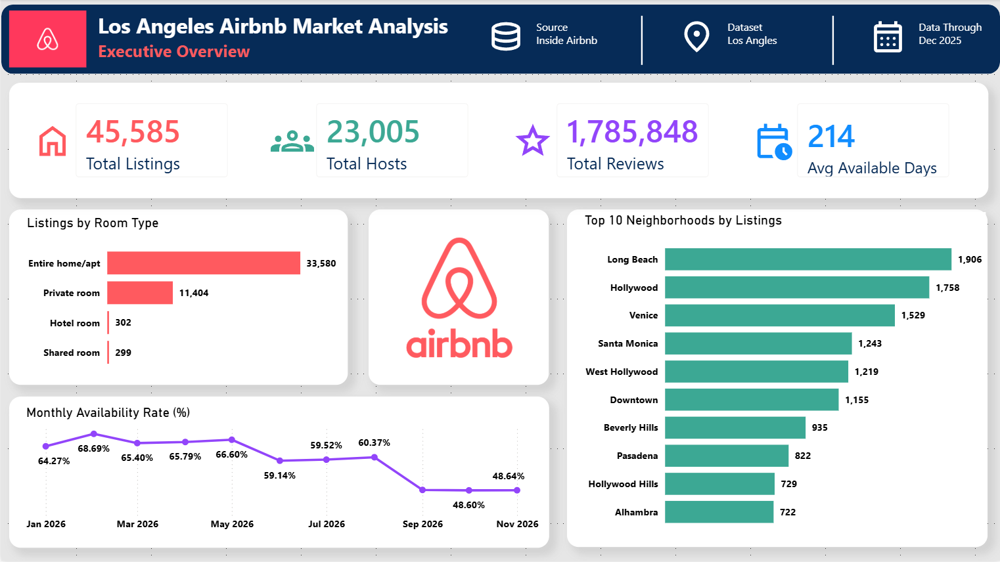
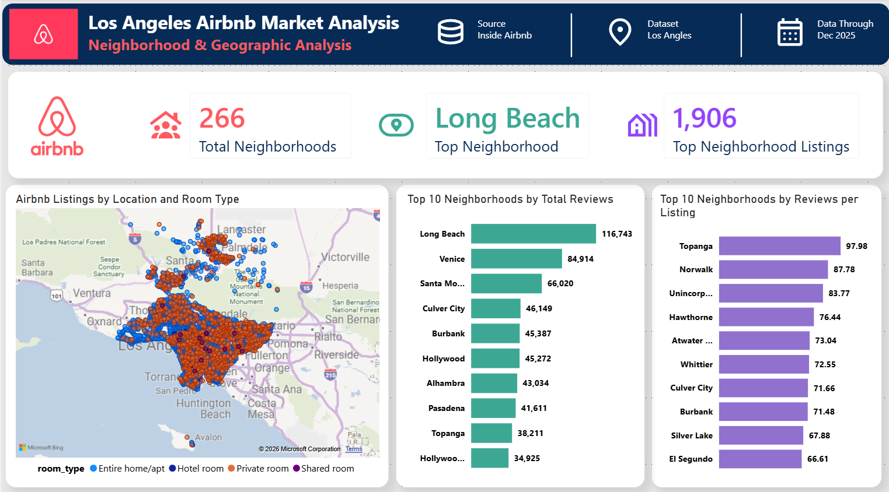
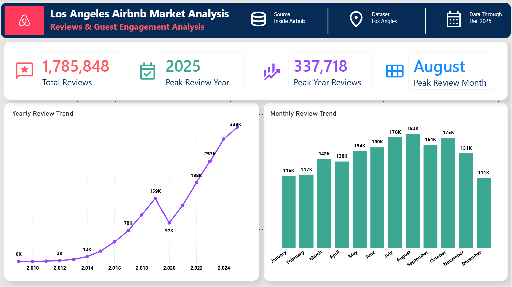
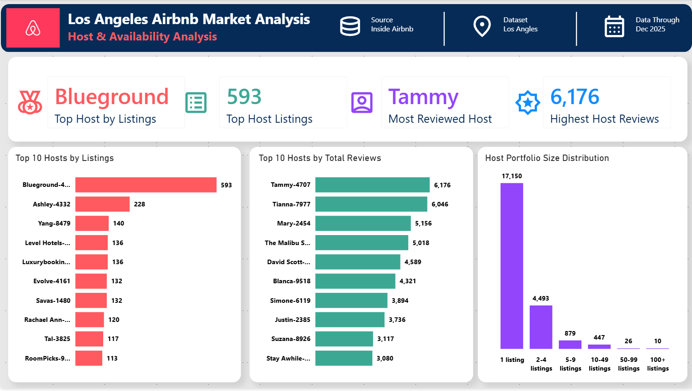

# Los Angeles Airbnb Market Analysis

An end-to-end data analytics project analyzing the Los Angeles Airbnb market using **PostgreSQL, SQL, and Power BI**.

The project transforms raw Inside Airbnb data into a structured PostgreSQL database, performs data validation and business-focused SQL analysis, creates reporting-ready BI views, and presents the results through a four-page Power BI dashboard.

---

## Project Overview

The objective of this project is to analyze the structure, geographic distribution, guest engagement, and host activity of the Los Angeles Airbnb market and translate the findings into actionable business insights.

The analysis focuses on four key areas:

1. **Executive Market Overview**
2. **Neighborhood & Geographic Analysis**
3. **Reviews & Guest Engagement**
4. **Host & Availability Analysis**

The complete analytical workflow is:

**Raw Data → PostgreSQL → Data Validation → SQL Analysis → BI Views → Power BI → Business Insights**

---

## Dashboard

The Power BI report contains four pages designed to move from high-level market performance to more detailed geographic, guest-engagement, and host analysis.

### 1. Executive Overview

Provides a high-level view of the Los Angeles Airbnb market, including:

- Total listings
- Total hosts
- Total reviews
- Average available days
- Listings by room type
- Top neighborhoods by listings
- Monthly availability trend



### 2. Neighborhood & Geographic Analysis

Examines where Airbnb activity is concentrated and how neighborhoods compare.

Key analysis includes:

- Total neighborhoods
- Top neighborhood by listings
- Geographic listing distribution
- Room-type distribution
- Top neighborhoods by total reviews
- Reviews per listing by neighborhood



### 3. Reviews & Guest Engagement Analysis

Uses historical review activity as an indicator of guest engagement.

Key analysis includes:

- Total reviews
- Peak review year
- Peak-year review volume
- Peak review month
- Yearly review trend
- Monthly review distribution



### 4. Host & Availability Analysis

Examines host concentration and portfolio structure.

Key analysis includes:

- Top host by listings
- Top host listing count
- Most reviewed host
- Highest host review count
- Top hosts by listings
- Top hosts by total reviews
- Host portfolio-size distribution



---

## Key Findings

The analysis identified several notable characteristics of the Los Angeles Airbnb market:

- The dataset contains **45,585 listings** managed by **23,005 unique hosts**.
- Listings have accumulated approximately **1.79 million reviews**.
- Listings are available for an average of approximately **214 days per year**.
- **Entire homes/apartments dominate the market**, accounting for 33,580 listings.
- **Long Beach** has the largest listing concentration with **1,906 listings**.
- Long Beach also records the highest total review volume among the analyzed neighborhoods.
- **2025** recorded the highest review activity with **337,718 reviews**.
- **August** has the highest historical monthly review activity.
- The largest host portfolio contains **593 listings**.
- The most reviewed host has accumulated **6,176 reviews**.
- Most hosts operate relatively small portfolios, with **17,150 hosts managing only one listing**.

---

## Analytical Considerations

### Neighborhood Reviews per Listing

Neighborhoods with very small listing counts can produce unusually high reviews-per-listing values.

To make the comparison more representative, a minimum threshold of **100 listings** was applied when ranking neighborhoods by reviews per listing.

This reduces small-sample distortion and focuses the comparison on established Airbnb markets.

### Host Identification

Host names are not necessarily unique.

Host-level analysis therefore uses `host_id` as the unique identifier rather than relying only on `host_name`.

A display field combining the host name with part of the host identifier was used in Power BI to prevent hosts with identical names from being incorrectly grouped together.

---

## Data Source

Data was obtained from **Inside Airbnb** for the Los Angeles market.

Three datasets were used:

- `listings.csv`
- `calendar.csv`
- `reviews.csv`

Raw source files are not included in the GitHub repository due to file size and repository management considerations.

### Data Coverage

Calendar records in the project database range from:

**December 4, 2025 – December 10, 2026**

Historical review records range from:

**May 26, 2009 – December 9, 2025**

These dates represent the coverage found within the respective tables and should not automatically be interpreted as the official dataset publication or snapshot date.

---

## Database Structure

The project uses three primary PostgreSQL tables:

### `listings`

Contains listing-level information including:

- Listing ID
- Host information
- Neighborhood
- Geographic coordinates
- Room type
- Review metrics
- Availability

### `calendar`

Contains daily listing-level information including:

- Listing ID
- Date
- Availability
- Price
- Minimum nights
- Maximum nights

### `reviews`

Contains historical review activity including:

- Listing ID
- Review date

### Relationships

```text
                 ┌──────────── calendar
                 │
listings ────────┤
                 │
                 └──────────── reviews
```

Relationships are established through:

```text
listings.id → calendar.listing_id
listings.id → reviews.listing_id
```

---

## SQL Workflow

SQL was used throughout the project for database creation, validation, analysis, and preparation of reporting datasets.

The SQL workflow is organized into:

```text
sql/
├── 00_create_tables.sql
├── 01_data_import_notes.sql
├── 02_data_validation.sql
├── 03_market_overview.sql
├── 04_neighborhood_analysis.sql
├── 05_host_analysis.sql
├── 06_calendar_analysis.sql
├── 07_reviews_analysis.sql
├── 08_bi_views.sql
├── 09_performance_indexes.sql
└── 99_price_analysis_notes.sql
```

### SQL techniques demonstrated

The project uses:

- Aggregations
- `GROUP BY`
- `HAVING`
- `COUNT(DISTINCT)`
- Date functions
- Conditional logic
- Common Table Expressions (CTEs)
- Ranking and filtering
- SQL views
- Index creation
- Data-quality validation

---

## BI Views

Reporting-ready SQL views were created before dashboard development.

This separates analytical logic from the visualization layer and provides several benefits:

- Centralized business logic
- Easier validation
- Reusable analytical datasets
- Simpler Power BI modeling
- Greater consistency between SQL and dashboard results

BI view definitions are available in:

`sql/08_bi_views.sql`

---

## Pricing Analysis Limitation

Pricing fields were investigated during data validation and exploratory analysis.

However, a reliable pricing analysis was **not included in the final dashboard** because the pricing data contains substantial missing (`NULL`) values.

Using only the available price records could produce incomplete or misleading market-level pricing conclusions.

The imported pricing fields also require additional cleaning and numeric conversion before detailed analysis.

Rather than presenting potentially unreliable pricing metrics, pricing analysis was excluded from the final dashboard.

Investigation notes are retained in:

`sql/99_price_analysis_notes.sql`

---

## Tools & Technologies

| Tool | Purpose |
|---|---|
| **PostgreSQL** | Relational database and analytical storage |
| **SQL** | Data validation, transformation and analysis |
| **pgAdmin** | PostgreSQL administration and query development |
| **Power BI** | Dashboard development and visualization |
| **Power Query** | Selected dashboard-level transformations |
| **Git** | Version control |
| **GitHub** | Project hosting and documentation |

---

## Repository Structure

```text
Los-Angeles-Airbnb-Market-Analysis/
│
├── README.md
│
├── backups/
│
├── dashboard/
│   ├── powerbi/
│   ├── screenshots/
│   └── tableau/
│
├── data/
│   ├── exports/
│   └── raw/
│
├── docs/
│   ├── business_questions.md
│   ├── data_dictionary.md
│   └── methodology.md
│
└── sql/
    ├── 00_create_tables.sql
    ├── 01_data_import_notes.sql
    ├── 02_data_validation.sql
    ├── 03_market_overview.sql
    ├── 04_neighborhood_analysis.sql
    ├── 05_host_analysis.sql
    ├── 06_calendar_analysis.sql
    ├── 07_reviews_analysis.sql
    ├── 08_bi_views.sql
    ├── 09_performance_indexes.sql
    └── 99_price_analysis_notes.sql
```

Database backups and large raw source datasets are excluded from version control.

---

## Documentation

Additional project documentation is available in the `docs` directory:

- [`business_questions.md`](docs/business_questions.md) — analytical questions addressed by the project
- [`data_dictionary.md`](docs/data_dictionary.md) — database tables, columns, data types, and relationships
- [`methodology.md`](docs/methodology.md) — detailed analytical methodology, validation approach, assumptions, and limitations

---

## Skills Demonstrated

This project demonstrates practical experience with:

- Relational database design
- PostgreSQL
- SQL data validation
- Data-quality assessment
- Exploratory data analysis
- Business-focused analytical querying
- Aggregation and segmentation
- SQL views
- Data modeling
- Power Query
- DAX
- Power BI dashboard development
- Data visualization
- Analytical decision-making
- Git version control
- Technical documentation

---

## Project Approach

The project was designed to demonstrate the complete analytics process rather than dashboard creation alone:

**Business Question → Data Validation → SQL Analysis → BI Dataset → Visualization → Insight**

Analytical decisions and limitations are documented so that dashboard results can be traced back to reproducible SQL logic.